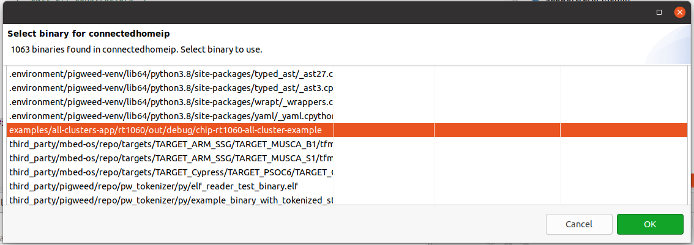
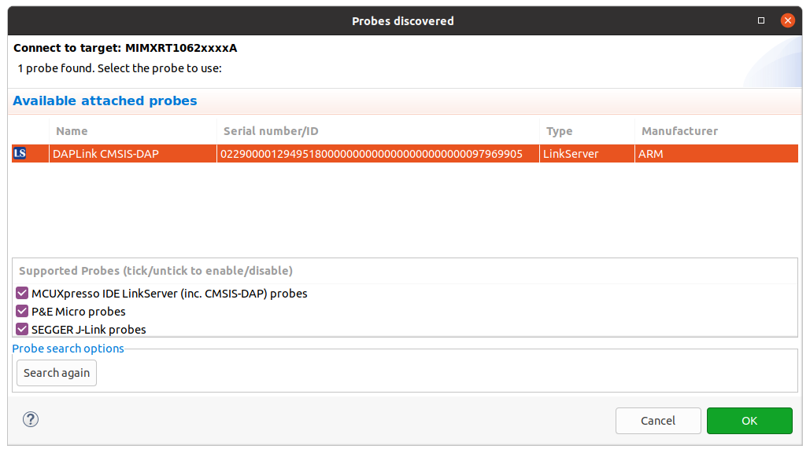
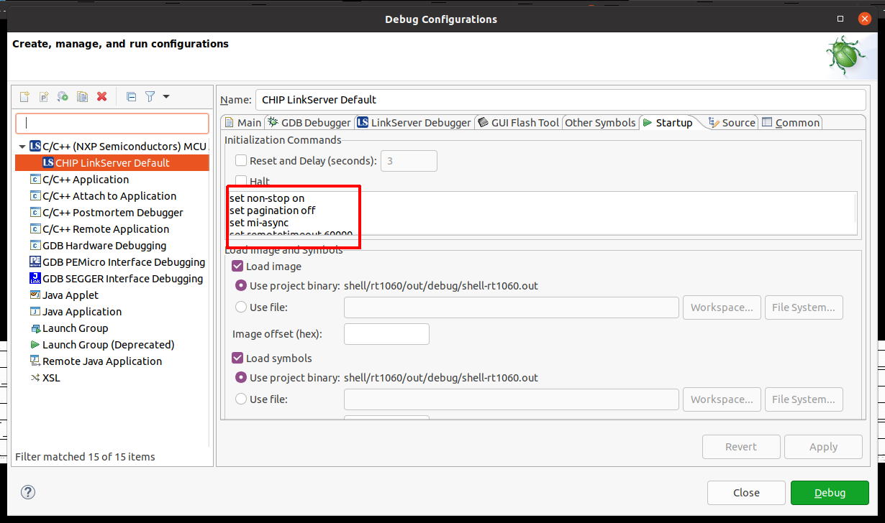

# CHIP RT1060 All-cluster Application

The all-cluster example implements a server wich can be accesed by a CHIP controller and acts 
on software level as a zigbee coordinator and accepts basic ZCL comands on a number of clusters.

The example is based on
[Project CHIP](https://github.com/project-chip/connectedhomeip) and the NXP RT1060 SDK,
and provides a prototype application that demonstrates device commissioning and different cluster
control.


<hr>

-   [Introduction](#intro)
-   [Building](#building)
-   [Manufacturing data](#manufacturing)
-   [Flashing and debugging](#flashdebug)
-   [Testing the example](#testing-the-example)

<hr>

<a name="intro"></a>

## Introduction


The RT1060 all-cluster application provides a working demonstration of the
RT1060 board integration, built using the Project CHIP codebase and the NXP
RT1060 SDK. The example supports basic ZCL commands.

The example supports:

- Matter over ethernet. For that follow instructions from [README_Ethernet.md][README_Ethernet.md].
- Matter over wi-fi. For that follow instructions from [README_Wifi.md][README_Wifi.md].
- Matter over openthread. For that follow instructions from [README_Openthread.md][README_Openthread.md].

[README_Ethernet.md]: README_Ethernet.md
[README_Wifi.md]: README_Wifi.md
[README_Openthread.md]: README_Openthread.md

The example targets the
[NXP MIMXRT1060-EVKB](https://www.nxp.com/design/development-boards/i-mx-evaluation-and-development-boards/mimxrt1060-evk-i-mx-rt1060-evaluation-kit:MIMXRT1060-EVK)
board by default. It is also possible to use the older EVK-MIMXRT1060 board, build and board setup instructions differ in some steps.


<a name="building"></a>

## Building

In order to build the Project CHIP example, we recommend using a Linux
distribution (the demo-application was compiled on Ubuntu 20.04).

-   Download [NXP MCUXpresso SDK 2.12.0](https://github.com/NXPmicro/mcux-sdk/tree/MCUX_2.12.0_UPDATE)
    and associated middleware from GitHub using the west tool.

```
user@ubuntu:~/Desktop/git/connectedhomeip$ source ./scripts/activate.sh
user@ubuntu:~/Desktop/git/connectedhomeip$ cd third_party/nxp/rt_sdk/repo
user@ubuntu:~/Desktop/git/connectedhomeip/third_party/nxp/rt_sdk/repo$ west init -l manifest --mf west.yml
user@ubuntu:~/Desktop/git/connectedhomeip/third_party/nxp/rt_sdk/repo$ west update
```

-   Apply the patches to the downloaded SDK.

```
user@ubuntu:~/Desktop/git/connectedhomeip/third_party/nxp/rt_sdk/repo$ cd ../sdk_fixes
user@ubuntu:~/Desktop/git/connectedhomeip/third_party/nxp/rt_sdk/sdk_fixes$ ./patch_rt_sdk.sh
user@ubuntu:~/Desktop/git/connectedhomeip/third_party/nxp/rt_sdk/sdk_fixes$ cd ../../../../examples/all-clusters-app/nxp/rt/rt1060/
```

-   In case you want to update the already downloaded SDK and/or reapply the SDK patches (which should be done when the `manifest/west.yml` file or the patches have changed),
    use the `west forall` command instead of the `west init` to reset the west workspace before running the `west update` command and applying patches again.

```
user@ubuntu:~/Desktop/git/connectedhomeip/third_party/nxp/rt_sdk/repo$ west forall -c "git reset --hard && git clean -xdf" -a
```

-   Start building the application.

Refer to the Building section in ethernet, wi-fi or openthread specific README file.

<a name="manufacturing"></a>

## Manufacturing data

See [Guide for writing manufacturing data on NXP devices](../../../../platform/nxp/doc/manufacturing_flow.md)

Other comments:

The RT1060 all cluster app demonstrates the usage of encrypted Matter manufacturing data storage. Matter manufacturing data should be encrypted before flashing them to the RT1060 flash. 

For development purpose the RT1060 all cluster app code could use the hardcoded AES 128 software key. This software key should be used only during development stage. 

For production usage, it is recommended to use the OTP key which needs to be fused in the RT1060 SW_GP2. The application note AN12800 should be followed to get more information. In this case the all cluster app should be updated to indicate to the DCP module to use the OTP key instead of the software key.
For that the call to "dataReaderEncryptedDCPInstance->SetAes128Key(&aes128TestKey[0]);" should be changed to "dataReaderEncryptedDCPInstance->SetKeySelected(arg);" with the arg value specifying where the OTP key is stored (kDCP_OCOTPKeyLow for [127:0] of SW_GP2 or kDCP_OCOTPKeyHigh for [255:128] of SW_GP2).

<a name="flashdebug"></a>

## Flashing and debugging

In order to flash the application we recommend using
[MCUXpresso IDE (version >= 11.6.0)](https://www.nxp.com/design/software/development-software/mcuxpresso-software-and-tools-/mcuxpresso-integrated-development-environment-ide:MCUXpresso-IDE).

- Import the previously downloaded NXP SDK into MCUXpresso IDE.

Right click the empty space in the MCUXpresso IDE's "Installed SDKs" tab to show the menu, select the "Import local SDK Git repository" menu item.


The "Import SDK Git" window will open. The "Repository location" text field should point to the west workspace (third_party/nxp/rt_sdk/repo subfolder of the Matter repository). The "Manifest(s) folder" text field should point to its core subfolder (third_party/nxp/rt_sdk/repo/core subfolder of the Matter repository). Click "OK" and wait for MCUXpresso IDE to import the SDK.


Finally select the desired board's SDK manifest in the "Installed SDKs" tab.


-   Import the connectedhomeip repo in MCUXpresso IDE as Makefile Project. Use _none_ as _Toolchain for Indexer Settings_:

```
File -> Import -> C/C++ -> Existing Code as Makefile Project
```

- Configure MCU Settings:

```
Right click on the Project -> Properties -> C/C++ Build -> MCU Settings -> Select MIMXRT1060 -> Apply & Close
```


Sometimes when the MCU is selected it will not initialize all the memory regions (usualy the BOARD_FLASH, BOARD_SDRAM 
and NCAHCE_REGION) so it is required that this regions are added manualy like in the image above. In addition to that 
on the BOARD_FLASH line, in the driver tab: 
```
click inside the tab and on the right side a button with three horizontal dots will appear 
click on the button and an window will show
form the dropdown menu select the MIMXRT1060_SFDP_QSPI driver
```


- Configure the toolchain editor:

```
Right click on the Project -> C/C++ Build-> Tool Chain Editor -> NXP MCU Tools -> Apply & Close
```


- Create a debug configuration:

```
Right click on the Project -> Debug -> As->MCUXpresso IDE LinkServer (inc. CMSIS-DAP) probes -> OK -> Select elf file
```





- Set the _Connect script_ for the debug configuration to _RT1060_connect.scp_ from the dropdown list:

```
Right click on the Project -> Debug As -> Debug configurations... -> LinkServer Debugger
```


- Set the _Initialization Commands_ to:

```
Right click on the Project -> Debug As -> Debug configurations... -> Startup

set non-stop on
set pagination off
set mi-async
set remotetimeout 60000
##target_extended_remote##
set mem inaccessible-by-default ${mem.access}
mon ondisconnect ${ondisconnect}
set arm force-mode thumb
${load}
```



- Set the _vector.catch_ value to _false_ inside the .launch file:

```
Right click on the Project -> Utilities -> Open Directory Browser here -> edit *.launch file:

<booleanAttribute key="vector.catch" value="false"/>

```

- Debug using the newly created configuration file:

<a name="testing-the-example"></a>

## Testing the example

1. Prepare the board with the flashed `All-cluster application` (as shown above). 
2. The All-cluster example example uses UART to print logs while runing the server. To view raw UART output, start a terminal emulator like PuTTY and connect to the used COM port with the following UART settings:

   - Baud rate: 115200
   - 8 data bits
   - 1 stop bit
   - No parity
   - No flow control

3. Open a terminal connection on the board and watch the printed logs.

4. On the client side, start sending commands using the [chip-tool](https://github.com/project-chip/connectedhomeip/blob/master/examples/chip-tool)  application as it is described [here](https://github.com/project-chip/connectedhomeip/blob/master/examples/chip-tool/README.md#using-the-client-to-send-matter-commands).
